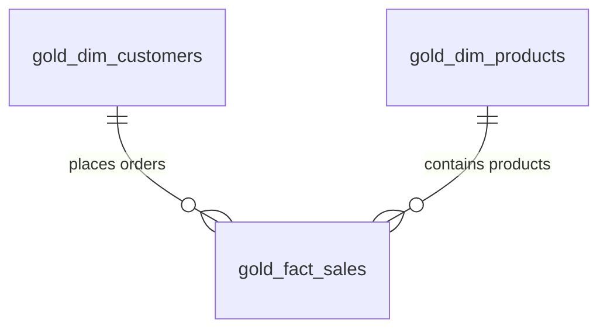

# Data_Analytics_project
Exploratory Data Analysis

> ### 🔤 Database Collation Requirements
> This analytics schema expects a target database instance built with the **`SQL_Latin1_General_CP1_CI_AS`** collation settings. 
> * **Case Insensitive (CI):** Business keys and identifiers are matched regardless of letter case variations.
> * **Accent Sensitive (AS):** Ensure your source text data strings contain matching diacritical markers across both CRM and ERP platforms to avoid joining dropouts.
> * 

# 📊 Advanced SQL Data Analytics Project

A comprehensive collection of production-grade SQL scripts for exploratory data analysis (EDA), advanced metrics, time-series forecasting, cumulative analytics, and customer/product segmentation.

This repository transforms raw, multi-source transactional staging layers into a high-performance **Gold Layer Star Schema**, providing data analysts, engineers, and BI professionals with a structured framework for complex enterprise reporting.

---

## 📐 Data Architecture & Schema

Our logical warehouse schema separates dimensional contexts from transactional facts, utilizing high-efficiency surrogate keys rather than variable source identifiers.



### 🔤 Database Collation Requirements
This analytics layer expects a database instance built with **`SQL_Latin1_General_CP1_CI_AS`** rules:
*   **Case Insensitive (CI):** Join lookups map keys seamlessly across system registers, matching values regardless of character case variations (e.g., `'PRD100'` = `'prd100'`).
*   **Accent Sensitive (AS):** Exact diacritical matching is enforced (e.g., `'México'` and `'Mexico'` are treated as separate attributes).

---

## 📖 Master Data Dictionary Catalog

| Folder / Table Name | Field Name | Recommended Data Type | Constraint / Key | Business Rules / Transformation Logic |
| :--- | :--- | :--- | :--- | :--- |
| 📁 **`01_Exploration`** | *N/A* | *N/A* | *Scripts* | Contains foundational schema verification scripts and system validation checks. |
| 👥 **`gold.dim_customers`** | `customer_key` | `INT` (Identity) | **Primary Key** | Surrogate row sequence generated using explicit sorting over `cst_id`. |
| | `customer_id` | `VARCHAR(50)` | Alternate Key | Operational entry unique ID extracted from CRM databases. |
| | `customer_number` | `VARCHAR(50)` | Alternate Key | Source mapping natural business primary tracking keys. |
| | `first_name` | `VARCHAR(100)` | Attribute | Customer's given name. |
| | `last_name` | `VARCHAR(100)` | Attribute | Customer's family name. |
| | `country` | `VARCHAR(100)` | Attribute | Geographical target address pulled from the ERP location tables. |
| | `marital_status` | `VARCHAR(20)` | Attribute | Marital status indicator sourced from the CRM ledger. |
| | `gender` | `VARCHAR(20)` | Attribute | Prioritizes CRM registry. Falls back to ERP info if CRM displays `'n/a'`. |
| | `birhdate` | `DATE` | Attribute | Birthdate records synced directly from the core ERP tables. |
| | `create_date` | `DATETIME` | Attribute | Profile instantiation timestamp registered inside CRM platforms. |
| 📦 **`gold.dim_products`** | `product_key` | `INT` (Identity) | **Primary Key** | Sequential identifier ordered by initialization date and primary keys. |
| | `product_id` | `VARCHAR(50)` | Alternate Key | Functional operational item code managed by the CRM system. |
| | `product_number` | `VARCHAR(50)` | Alternate Key | Distinct production master key utilized across operational layers. |
| | `product_name` | `VARCHAR(150)` | Attribute | Catalog marketing name for consumer identification. |
| | `category_id` | `VARCHAR(50)` | Attribute | Unique identifier for product groups within the CRM. |
| | `category` | `VARCHAR(100)` | Attribute | Tier-1 organizational product group derived from ERP lookups. |
| | `subcategory` | `VARCHAR(100)` | Attribute | Secondary descriptor mapping granular product types. |
| | `maintenance` | `VARCHAR(50)` | Attribute | Quality control tracking criteria or localized maintenance tier flags. |
| | `cost` | `DECIMAL(18,2)` | Attribute | Unit acquisition cost or initial production value adjustments. |
| | `product_line` | `VARCHAR(50)` | Attribute | Top-tier business vertical taxonomy categorization code. |
| | `start_date` | `DATE` | Attribute | Initialization date when the product configuration went active. |
| | *Filter Condition* | *N/A* | *Data Filter* | **Active Items Only:** Excludes historical profiles (`WHERE prd_end_dt IS NULL`). |
| 📊 **`gold.fact_sales`** | `order_number` | `VARCHAR(50)` | Business Key | Invoice item transactional identification sequence. |
| | `product_key` | `INT` | **Foreign Key** | Joins to `gold.dim_products.product_key` using item business keys. |
| | `customer_key` | `INT` | **Foreign Key** | Joins to `gold.dim_customers.customer_key` using system client IDs. |
| | `order_date` | `DATE` | Attribute | System entry timestamp denoting initial transactional authorization. |
| | `shipping_date` | `DATE` | Attribute | Logistics ledger timestamp marking outbound warehouse fulfillment. |
| | `due_date` | `DATE` | Attribute | Financial target settlement deadline. |
| | `sales` | `DECIMAL(18,2)` | Metric | Line-item gross sales revenue recorded from customer checkouts. |
| | `quantity` | `INT` | Metric | Number of discrete physical package elements purchased. |
| | `price` | `DECIMAL(18,2)` | Metric | Exact per-unit monetary transaction value finalized on invoice. |

---

## 📂 Repository Module Contents

This project is separated into thematic logical folders to make query exploration highly accessible:

*   **`01_Database_Exploration/`**: Baseline diagnostic scripts, catalog lookups, row counting templates, and metadata evaluations.
*   **`02_Measures_and_Metrics/`**: Core aggregations covering total item revenues, absolute quantities, and net checkout valuations.
*   **`03_Time_Based_Trends/`**: Year-Over-Year (YoY) growths, rolling averages, and cyclical fiscal trends.
*   **`04_Cumulative_Analytics/`**: Running totals, historical accumulation ledgers, and month-to-date (MTD) data tracks.
*   **`05_Segmentation/`**: Customer RFM (Recency, Frequency, Monetary) groups and ABC product category tier assignments.

---

## 🛠️ Infrastructure Build and Deployment

Compile views against your relational database cluster sequentially to honor strict parent-child structural requirements:

```bash
# Execute scripts using standard client utilities
sqlcmd -S your_server -d your_warehouse -i deploy_gold_layer.sql
```

> **⚠️ Dependency Note:** The views use inner-dependencies. Ensure that `gold.dim_customers` and `gold.dim_products` are successfully compiled *before* creating or refreshing `gold.fact_sales`.


## 🛡️ License

This project is licensed under the MIT License. You are free to use, modify, and distribute this software for personal or commercial applications with proper attribution back to this repository.
